Intro
=====

Remote debugging is the ability to debug your code in Visual Studio while that
code is executing on another computer. You might have various reasons for
wanting to do this but in the case of developing an application which targets
the Thinc API it is indispensable. If you’ve ever tried to execute code that
instantiates the API you know that it won’t work. This is because the API
depends on underlying processes and dll’s to work and those files/processes
aren’t on your development machine. This is where remote debugging comes in.
When it is properly set up it will allow you to debug your app from Visual
Studio just like you normally would for any other app the difference being that
the execution of the code is happening on a machine not your PC.

Required Setup
==============

In order to use remote debugging you should have Visual Studio 2013 Pro or
above. 2010 had remote debugging but I was never able to get it to work in a
cross-domain scenario. If you know how to do it please share it with the
community.

This will only work on a machine with Window 7 and above. If your machine is
running Windows XP sorry you’re out of luck.

You will obviously need to have a network connection between the machine and
your PC. Both computers will need to be on the same subnet for this to work. If
you can ping the machine it should work.

Naming the machine (optional)
=============================

This step is not absolutely necessary but it will make life a lot easier in the
long run. By default the computer name on all Okuma machines comes in a
something like OKUMA-ADAS33421. You could also use the IP address of the machine
but it much easier to give the computer an easy to remember name. So I usually
rename it to something easy to remember like SHOP-L300E. The picture below shows
you how to change the computer name. After changing the name Windows will prompt
you to restart to apply the changes.

Select ‘Restart Later’ and power the machine off/on using the normal procedure.
If you let Windows do it you will end up with Device Net errors and will end up
shutting it down manually anyways.

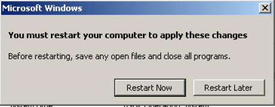

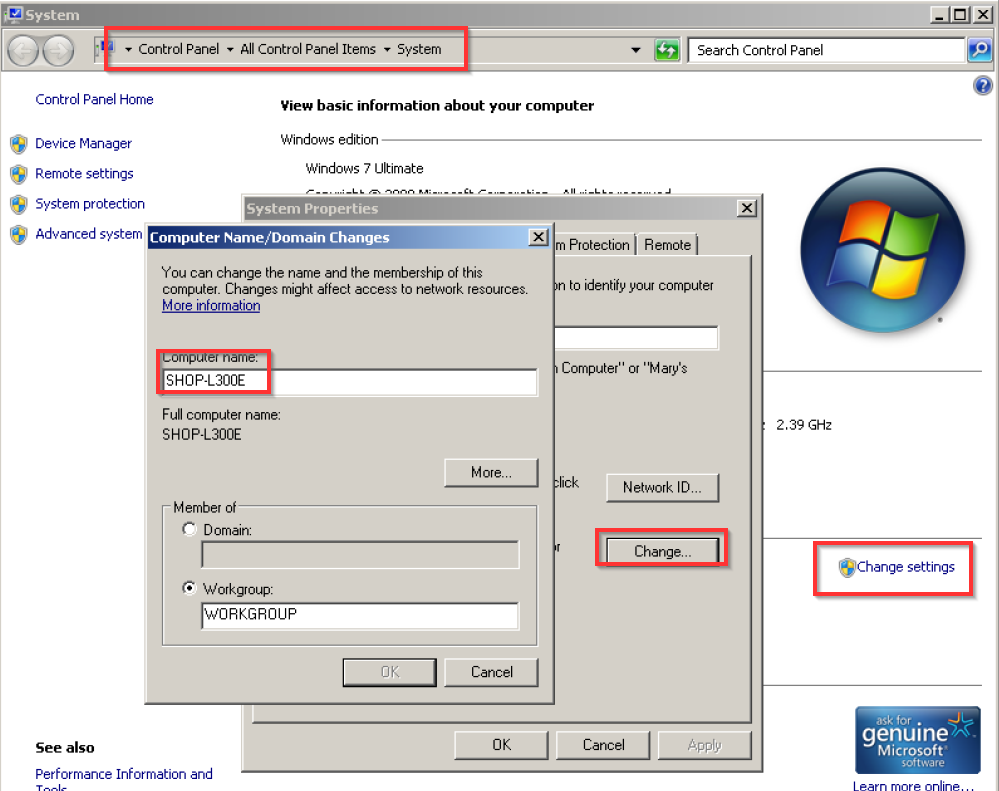

Create a shared folder on the machine
=====================================

Next you will need to create a shared folder. This folder will be used as the
build target in Visual Studio. I usually just create a ‘Gosiger’ folder on the
D:\\ drive for this purpose. After creating the folder click ‘Share With’ in
Explorer or right click the folder and go to properties and then sharing.

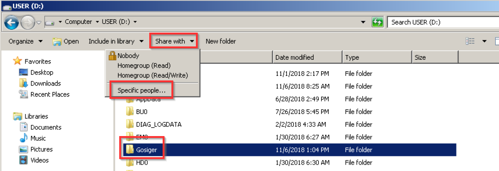

In the dialog that appears share the folder with everyone and set the Permission
level to Read/Write and then click ‘Share’

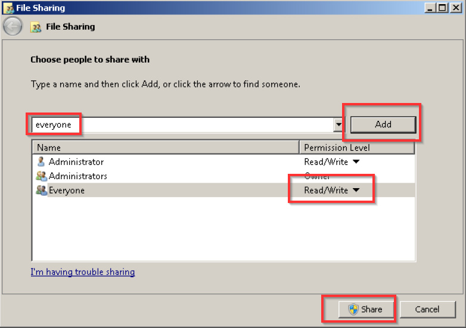

Mapping the shared folder on your dev PC
========================================

From your dev PC open up Windows Explorer and in the address bar type in
[\\\\SHOP-l300e\\gosiger](file:///\\SHOP-l300e\gosiger) and push enter (Replace
the ‘SHOP-l300e’ and ‘gosiger’ with the name of your machine and folder).

You will see a dialog similar to this one:

**IMPORTANT:** because the machine is most likely not on your companies domain
you will have to specify that you want to connect directly to the machine
without going through the domain. You do this by typing in the name of the
computer followed by a backslash and then the user name. Once you type the
backslash the Domain: should change to the name of the machine (see below).

The default username and password on an okuma is:

administrator

okuma+osp

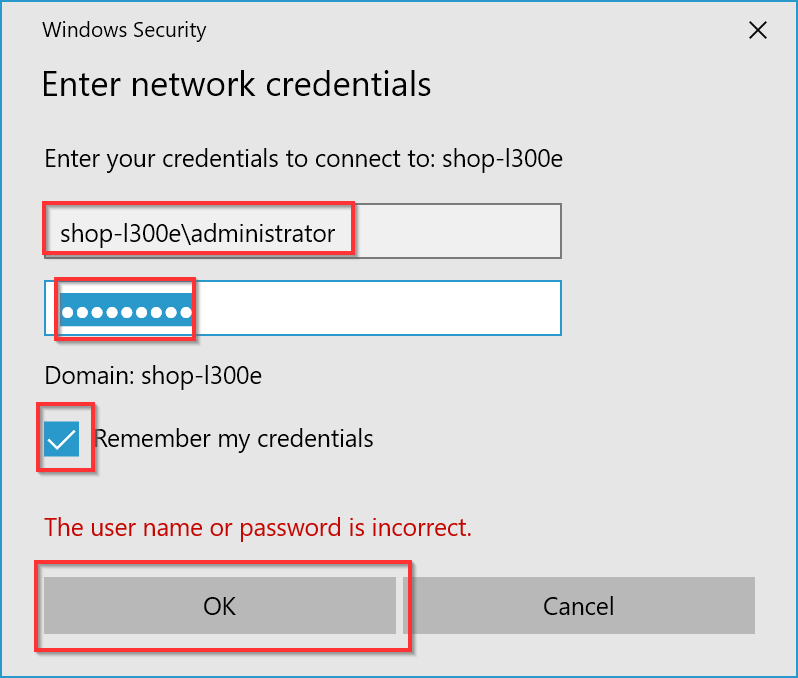

After you click ok you should see an empty folder and the address bar should
look like this:

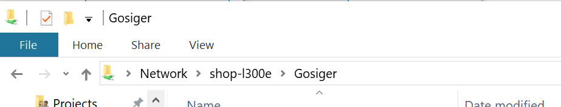

Copy remote debug application to the machine
============================================

On your development PC locate the installation directory for Visual Studio. On
my PC it is:

C:\\Program Files (x86)\\Microsoft Visual Studio\\2017\\Enterprise\\Common7\\IDE

In that folder you will find a folder called ‘Remote Debugger’

Inside ‘Remote Debugger’ you should have a folder called ‘x86’. This is the
folder for the 32 bit remote debug tool.

Copy this folder to the shared directory on the machine

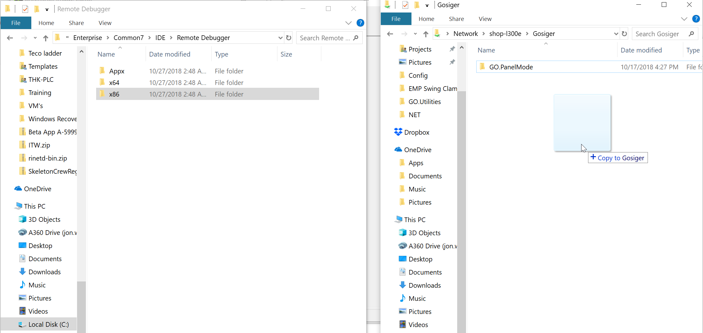

Install a VNC Viewer (optional)
===============================

If you the machine you’re working on is far away it’s not very convenient to
walk all the way over to it to interact with it. It is much easier if you use a
Remote Desktop software like VNC to access the touch screen remotely. There are
quite a few companies out there that offer VNC. The one I use is called [Tight
VNC](https://sourceforge.net/projects/vnc-tight/). It’s fairly lightweight and
doesn’t seem to bog down the machine PC very much. You will need to install the
server on the machine and the viewer on your PC. Once you have it installed you
can just enter the computer name you set earlier or the IP address.

Start the remote debugger on the machine
========================================

At the machine navigate to the shared folder. You should have an x86 folder
there now. Open that folder and locate msvsmon.exe. Double click it to start it.

Pro tip: If you open this folder and it shows the name of the file as msvsmon
without the .exe then do the world a favor and turn off the worst idea for an OS
setting every conceived called: ‘Hide extension of known file types’. To turn it
off open the start menu and type ‘Folder Options’ in Folder Options select the
‘View’ tab and then uncheck ‘Hide extensions for known file types’.

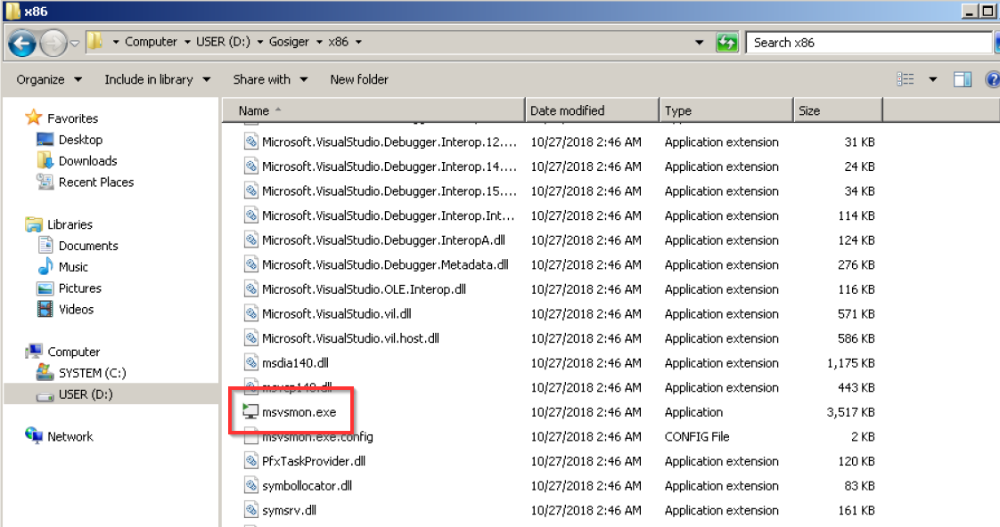

You should see this box pop up:

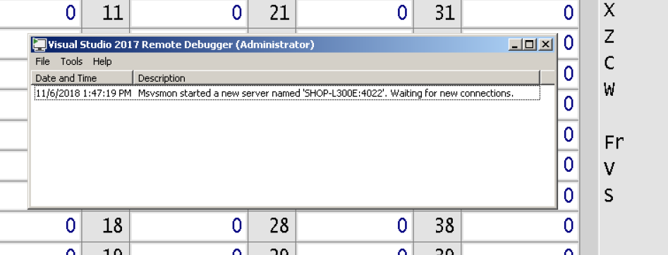

Note: occasionally the first time I run the remote debugger another menu will
pop up with some other options. This menu can be ignored just click ‘ok’ or
‘yes’.

***************************************
If possible, go to the Option menu and set the remote debug to use No Authentication to simplify the debugging process.
***************************************

Visual Studio Setup
===================

Create a ‘Remote’ configuration
-------------------------------

Now you need to setup your project for remote debugging. To start open up the
project you want to debug in Visual Studio.

Once it’s loaded click the dropdown for the configuration manager and select
‘Configuration manager’

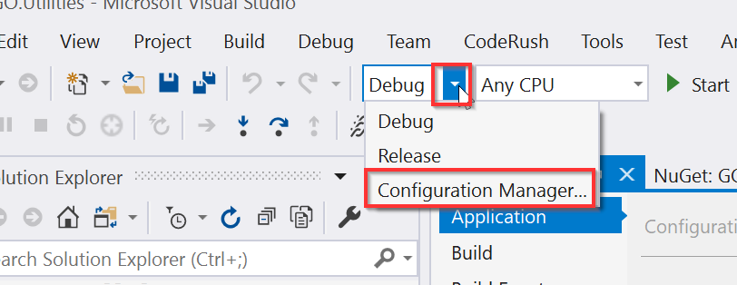

In the dialog that opens select new from the dropdown next to the project you
want to debug remotely:

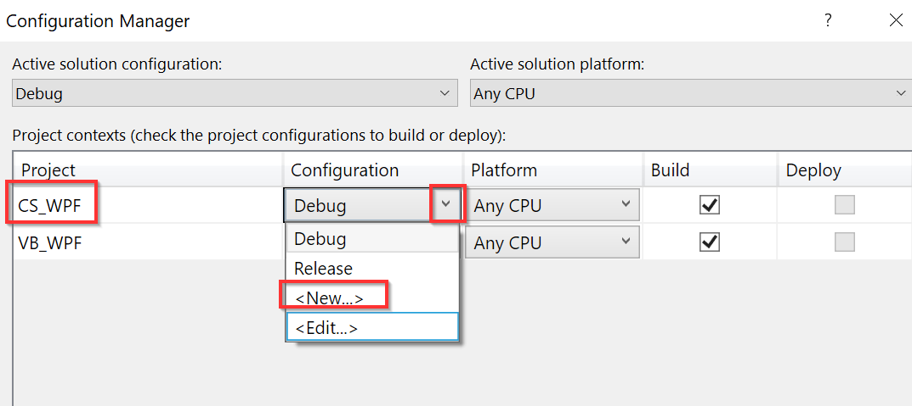

Give the configuration a name. I called mine ‘Remote’ and then select Debug from
the ‘Copy settings from:’ dropdown.

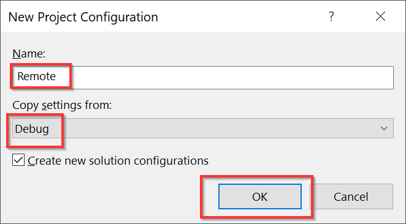

Set compile path
----------------

After you hit OK go to the project properties ‘Build’ tab (‘Compile’ if VB) and
change the output path to the path to your shared folder on the machine and push
enter. Click ‘OK’ to acknowledge that the path is not trusted.

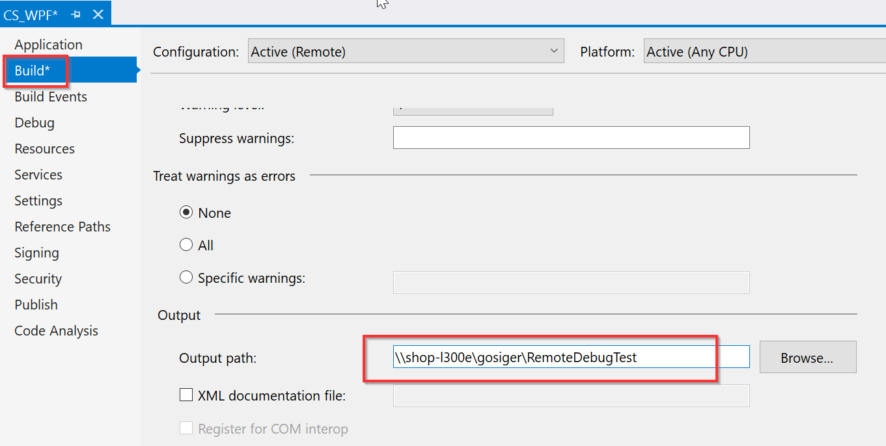

Set debug target
----------------

Now go to the ‘Debug’ tab and check ‘Use Remote Machine’ and put in the name of
the machine or its IP address.

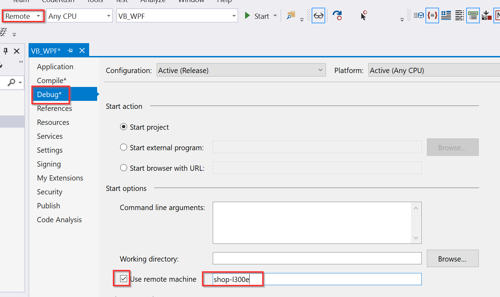

***************************************
If possible, select No Authentication in the Authentication Mode to simplify the debugging process.
***************************************

Building
--------

Now if you hit Ctrl+Shift+B Visual Studio should compile your code and copy it
to the folder on your machine. This step isn’t necessary but I include it just
to illustrate how it works.

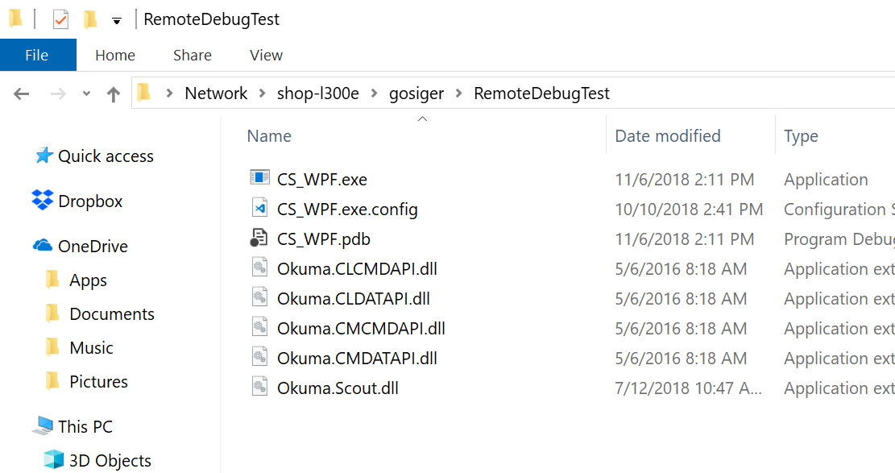

Debugging
---------

Now if you hit F5 or push the ‘Start’ button the application will execute on the
machine and you will be able to stop at break points and debug just as you
normally would locally.

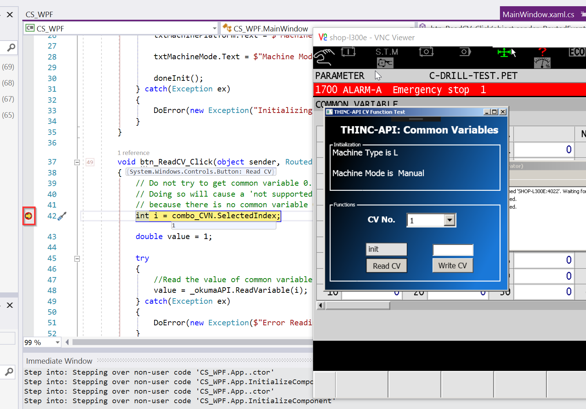
