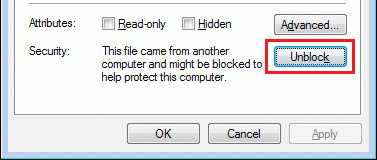

# Okuma Open API SDK v1.6.0

Software Development Kit for applications targeting Okuma OSP-P Machine Tools.  

## Welcome

Thank you for your interest in creating [Machine Tool Apps](http://www.okuma.com/wp-machine-tool-apps) for the Okuma OSP-P NC Control.  
We use [StackOverflow](http://stackoverflow.com/questions/tagged/okuma) to answer programming questions.

Open API questions should be sent to [API@okuma.com](mailto:API@okuma.com)  
Okuma App Store questions should be sent to [AppStore@okuma.com](mailto:AppStore@okuma.com)  

If you have an app you would like to appear on the MyOkuma.com App Store,  
please refer to "MyOkuma App Store App Guidelines.txt" before submitting.


## Getting Started

### :heavy_exclamation_mark: How to open API Help files  

 API help files are provided in .chm [Microsoft Compiled HTML Help](https://en.wikipedia.org/wiki/Microsoft_Compiled_HTML_Help) format.  
 For various reasons, these files might not open or display correctly.  
 If you experience this, please try the following:  

>    * Store the files locally and do not attempt to open over a netowrk
>    * Do not store the files in a directory which contains the '#' character.
>    * Right-click on the help file and select Properties.  
>      Then click the "Unblock" button.  

  

### :heavy_exclamation_mark: Calling THINC-API functions inside a thread
All functions of THINC-API can be called inside a thread if and only if the thread is not 
spawn by the system (thread pool).  BackgroundWorker thread or Task thread will use system thread pool
which will cause intermittent issue with the THINC-API library.

### :warning: Where can API functions be executed
 The API's `Init()` method must be called in the MAIN / GUI
 thread before accessing any machine data.  
 Furthermore, the initialization will **FAIL** if it is not 
 executed in an environment where OSP NC Software is running
 **AND** THINC API is installed with API Notifier service running
 and Initialized.

### :warning: Initialized THINC-API
All applications/services using THINC-API must use OKUMA Startup Service to start the applications/services to 
ensure that THINC-API is ready before trying to initialize THINC-API in the application itself. 
 
 The following environments will allow successful execution of API methods:  

    * PC NC-Master (PC Simulation Software)
    * NC-Master (Physical Hardware Simulator)
    * Actual Okuma Machine Tool with P-type control
    
    For information about simulation hardware or software, refer to
    'Documentation\Machine Simulators.txt' and contact your local Okuma distributor. 
[https://www.okuma.com/distributors](https://www.okuma.com/distributors)


## :notebook_with_decorative_cover: Structure

```  
├───API                ╔══════════════════════════════════════════════╗   
│   ├───1.12.1         ║  Recommended API versions for development.   ║  
│   │   ├───Bin        ║  Refer to the test applications for details  ║  
│   │   ├───Help       ║  about how to use each function in the       ║  
│   │   └───Test App   ║  API. Okuma uses these projects to verify    ║  
│   │       ├───Lathe  ║  the operation of the API before release.    ║  
│   │       └───MC     ╚══════════════════════════════════════════════╝  
│   ├───1.17.2
│   │   ├───Bin
│   │   ├───Help
│   │   └───Test App
│   │       ├───Lathe
│   │       └───MC
│   ├───1.19.0
│   │   ├───Bin
│   │   ├───Help
│   │   └───Test App
│   │       ├───ThincGrinder
│   │       │   ├───Lib
│   │       │   └───My Project
│   │       │       └───DataSources
│   │       ├───ThincLathe
│   │       │   └───lib
│   │       └───ThincMC
│   │           └───lib
│   ├───1.21.1
│   │   ├───Bin
│   │   ├───Help
│   │   └───Test App
│   │       ├───ThincGrinder
│   │       │   ├───Lib
│   │       │   └───My Project
│   │       │       └───DataSources
│   │       ├───ThincLathe
│   │       │   ├───lib
│   │       │   └───My Project
│   │       │       └───DataSources
│   │       └───ThincMC
│   │           ├───lib
│   │           └───My Project
│   │               └───DataSources
│   ├───1.23.1
│   │   ├───Bin
│   │   ├───Help
│   │   └───Test App
│   └───1.9.1
│       ├───Bin
│       ├───Help
│       └───Test App
│           ├───Lathe
│           └───MC
├───Documentation
│   └───THINC API Release Notes
│       ├───1.9.1
│       ├───1.10.0
│       ├───1.11.0
│       ├───1.11.1
│       ├───1.12.0
│       ├───1.12.1
│       ├───1.15.0
│       ├───1.16.0
│       ├───1.17.0
│       ├───1.17.1
│       ├───1.17.2
│       ├───1.18.0
│       ├───1.19.0
│       ├───1.20.0
│       ├───1.21.1
        └───1.23.1
├───Examples                   ╔══════════════════════════════════════════╗
│   ├───API Common Variables   ║  Example usage of the API                ║
│   │   ├───Compiled           ║  These examples, in different languages  ║
│   │   ├───CS_Lathe           ║  and targeting different machine types   ║
│   │   │   ├───Properties     ║  each demonstrate how to access common   ║
│   │   │   └───Resources      ║  variables.                              ║
│   │   ├───CS_MC              ╚══════════════════════════════════════════╝
│   │   │   └───Properties
│   │   ├───CS_WPF
│   │   │   └───Properties
│   │   ├───VB_Lathe
│   │   │   └───My Project
│   │   ├───VB_MC
│   │   │   └───My Project
│   │   └───VB_WPF
│   │       └───My Project
│   │           └───MyExtensions
│   ├───Python                     ※ API Tutorial for Python
│   ├───Single Instance            ※ Only allow one copy of a program to run at a time (examples)
│   │   ├───Single Instance CS_Forms
│   │   │   ├───bin
│   │   │   │   ├───Debug
│   │   │   │   └───Release
│   │   │   ├───obj
│   │   │   │   └───Debug
│   │   │   │       └───TempPE
│   │   │   └───Properties
│   │   ├───Single Instance CS_WPF
│   │   │   ├───bin
│   │   │   │   └───Debug
│   │   │   ├───obj
│   │   │   │   └───Debug
│   │   │   │       └───TempPE
│   │   │   └───Properties
│   │   └───Single Instance VB_Forms
│   │       ├───bin
│   │       │   └───Debug
│   │       ├───My Project
│   │       └───obj
│   │           └───Debug
│   │               └───TempPE
├───Images
├───OSP suite Shortcuts                 ※ Instructions and example to make shortcut
│   └───010-NOTEPAD
│       └───00000010
│           └───res
├───Register V-FKEY
│   ├───README.txt                      ※ Information about RegisterVfkey
│   └───RegisterVfkey.exe               ※ Utility to add shortcut to V-FKEY
├───Scout
│   ├───Doc
│   ├───Lib
│   │   ├───.NET 2.0
│   │   │   ├───Debug
│   │   │   └───Release
│   │   └───.NET 4.0
│   │       ├───Debug
│   │       └───Release
│   ├───Okuma.Scout.TestApp.net2
│   │   ├───bin
│   │   │   ├───Debug
│   │   │   └───Release
│   │   └───Properties
│   └───Okuma.Scout.TestApp.net4
│       ├───bin
│       │   ├───Debug
│       │   └───Release
│       ├───Helpers
│       ├───Properties
│       ├───Resources
│       ├───ViewModels
│       └───Views
└───TDG Logging                     ※ Library for creation of application logs
    ├───TDG.Logging 2.16            ※ The logging library and dependencies
    ├───TDG.Logging 4.19
    └───TestApp
        └───TDG Logging Example     ※ Test Application for TDG Logging Utility
            ├───Properties
            └───TextLogSyntax
```

## :mailbox_with_mail: Contact

[api@okuma.com](mailto:api@okuma.com)  


Do you enjoy developing applications for the Okuma OSP Control?  
Have some ideas you would like to share?  
Or maybe you would just enjoy the chance to talk with the experts?  

Consider joining the **THINC Developers Group**  
Contact: [thincdg@gmail.com](mailto:thincdg@gmail.com)  
Information:

  * [https://www.okuma.com/thinc-developers-group](https://www.okuma.com/thinc-developers-group)
  * [https://www.linkedin.com/company/thinc-developers-group](https://www.linkedin.com/company/thinc-developers-group)

## :memo: Revision History

Version | Date 			| Note  
:---	|:---			|:--  
v1.5    | 2018.09.21  	| API 1.21.1.0, SCOUT v4.12.36.1, TDG Logging 4.19 
v1.4    | 2017.11.01	| SCOUT .CHM Help File  
v1.3    | 2017.09.25	| API 1.19, SCOUT v4.1.0.0, TDG Logging 2.16, RegisterVfkey, OSP suite Shortcuts  
v1.2    | 2017.06.05	| SCOUT v2.3.0.0 & 4.0.0.0  
v1.0.1  | 2016.10.13	| SCOUT v2.2.1.0  
v1.0    | 2016.10.10	| SCOUT v2.2.0.0  
v0.8    | 2016.08.01	| SCOUT v1.0.4.0  
v0.7    | 2015.12.15	| API 1.18.0, SCOUT v1.0.2.0  
v0.6a   | 2015.08.24	| SCOUT v1.0.1.0, Update Cross Reference  
v0.5a   | 2015.06.05	| SCOUT v1.0.0.4  
v0.4a   | 2015.01.28	| add Scout libraries and test application  
v0.3a   | 2014.06.26	| add approval and widget Documentation    
v0.2a   | 2014.04.??	| API v1.17.1  
v0.1a   | 2014.04.??	| first distributed version   


## :construction: TO DO

  * Examples - Error Handling 
  * THINC API - Best Practices

___

Retrieved from GitHub :octocat:  
[https://github.com/OkumaAmerica/Open-API-SDK](https://github.com/OkumaAmerica/Open-API-SDK)

© 2019 Okuma America Corporation
